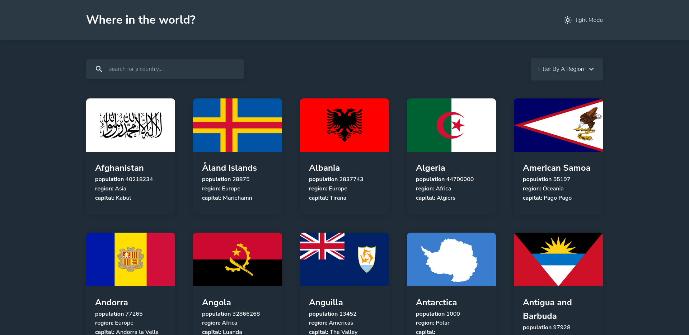
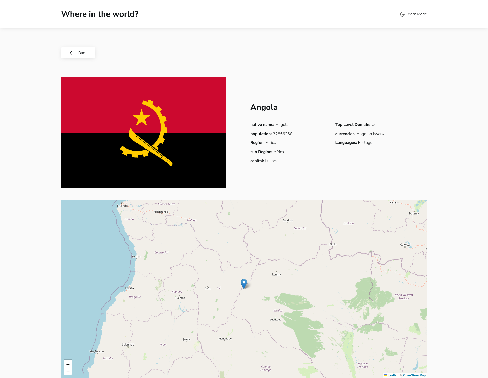

# Frontend Mentor - REST Countries API with color theme switcher solution

This is a solution to the [REST Countries API with color theme switcher challenge on Frontend Mentor](https://www.frontendmentor.io/challenges/rest-countries-api-with-color-theme-switcher-5cacc469fec04111f7b848ca). Frontend Mentor challenges help you improve your coding skills by building realistic projects.

## Table of contents

- [Overview](#overview)
  - [The challenge](#the-challenge)
  - [Screenshots](#screenshots)
  - [Links](#links)
- [My process](#my-process)
  - [Built with](#built-with)
  - [What I learned](#what-i-learned)
  - [Continued development](#continued-development)
  - [Useful resources](#useful-resources)

## Overview

### The challenge

Users should be able to:

- See all countries from the API on the homepage
- Search for a country using an `input` field
- Filter countries by region
- Click on a country to see more detailed information on a separate page
- Click through to the border countries on the detail page
- Toggle the color scheme between light and dark mode *(optional)*

### Screenshots

### Links

- Solution URL: [Repo](https://github.com/mohamedyasser27/rest-api-countries)
- Live Site URL: [Site](https://rest-countries-api-my.netlify.app/)

## My process

### Built with

- Semantic HTML5 markup
- CSS custom properties
- Flexbox
- CSS Grid
- Mobile-first workflow
- React
- React-router
- scss

### What I learned

- use switch theme using custom hooks and context to change the used color variables across the whole website.
- use accessibility properties like "aria-expanded","role","aria-haspopup".
- use _redirects to configure routing on hosting platform.
- use SVGR to use SVGs as components for cleaner code.
- use react router to manage routing.
- use custom hooks.
- usage of line clamp to limit the number of lines

### Continued development

### Useful resources

- [react router course 1](https://www.youtube.com/playlist?list=PLC3y8-rFHvwjkxt8TOteFdT_YmzwpBlrG) - this helped me with understanding the basics of react routing

- [react router course 2](https://www.youtube.com/playlist?list=PL4cUxeGkcC9iVKmtNuCeIswnQ97in2GGf) - this helped me with newer version of react router
